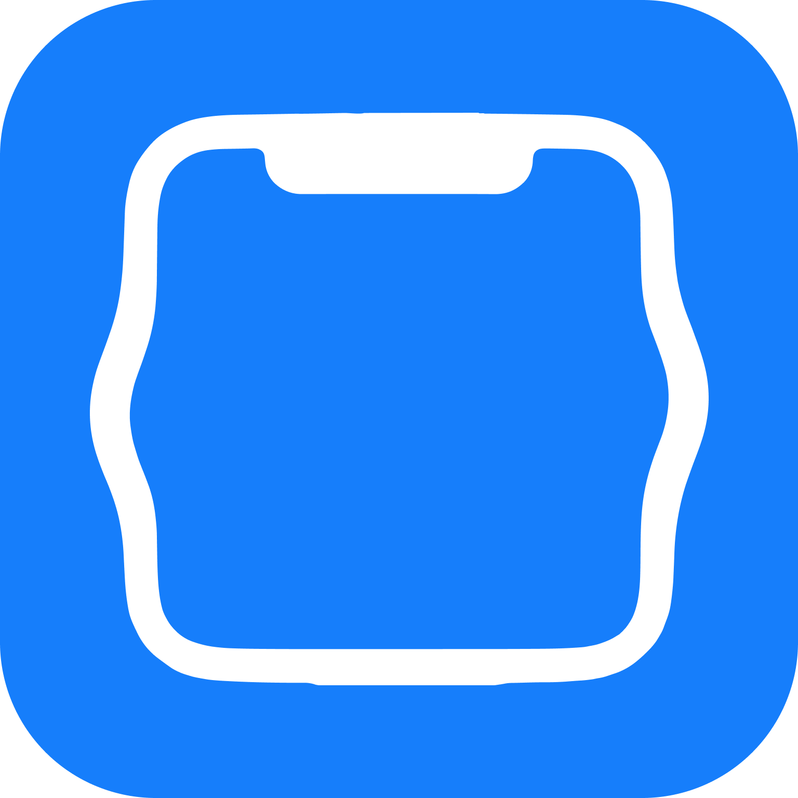

<div align="center">



# Re:notch

Turn your Mac's notch into a lightweight, native developer command center.

[](https://developer.apple.com/macos/)
[](https://github.com/yosaiy/renotch/releases)
[](LICENSE.md)

[**Download Latest**](https://github.com/yosaiy/renotch/releases/latest) • [**Report Bug**](https://github.com/yosaiy/renotch/issues)

</div>

---

## Features


- **Dev Activity**: Track local servers, ports, Git status, Docker containers, and build jobs.
- **Media Control**: Apple Music & Spotify playback with album art and controls.
- **Productivity**: Focus timer, clipboard history, and file drop shelf.
- **Browser Bridge**: YouTube playback and Chromium download monitor.
- **Native & Private**: Swift/SwiftUI, fluid animations, 100% local, zero telemetry.

---

## Install

### Download
Grab the latest `Re:notch.app` from **[Releases](https://github.com/yosaiy/renotch/releases/latest)** and move it to `/Applications`.

### Build from Source
```bash
git clone https://github.com/yosaiy/renotch.git
cd renotch
swift run Renotch
```

To build a standalone `.app` bundle:
```bash
./scripts/build-app.sh
```

---

## Browser Extension (Optional)

Enables YouTube and download tracking:
1. Open `chrome://extensions` in Chrome/Arc/Brave/Edge.
2. Enable **Developer mode**.
3. Click **Load unpacked** and select the `BrowserExtension` directory.

---

## Privacy

Re:notch is **100% local**. No accounts, no telemetry, no cloud sync. All data stays on your Mac.

---

## License

MIT © [yosaiy](https://github.com/yosaiy)
